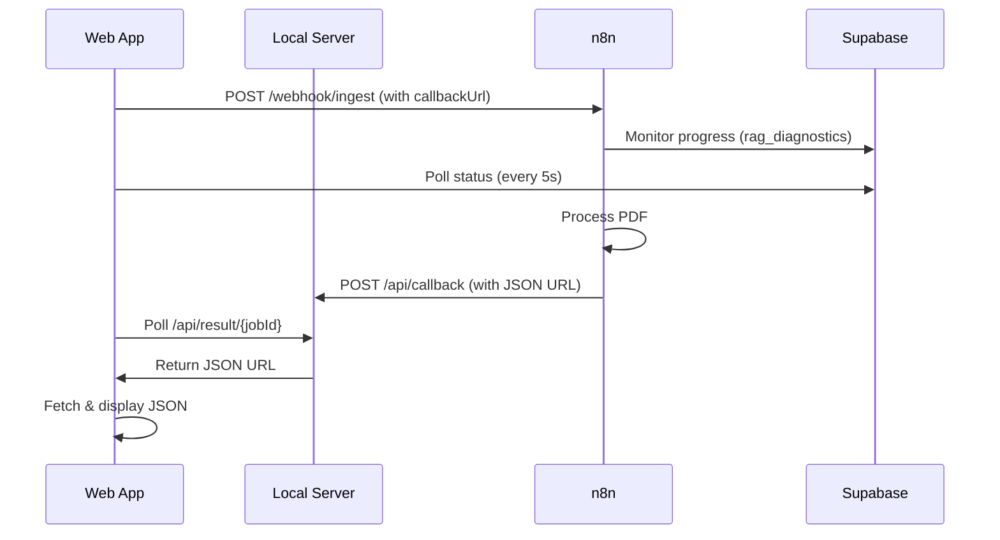
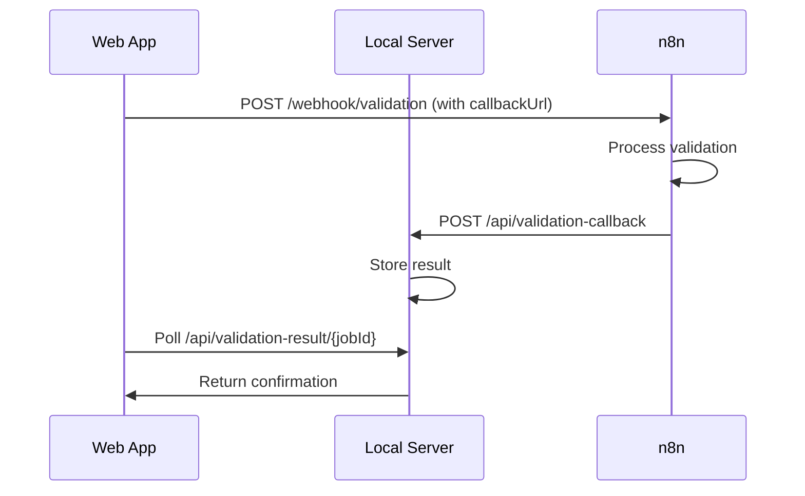

# 📡 Callback Configuration Guide

This guide explains how to configure n8n workflows to send callbacks to the local server.

## 🚀 Quick Start

### 1. Start the Local Server

```bash
python server.py
```

The server will start on `http://localhost:8000` with these endpoints:

- **Extraction Callback**: `http://localhost:8000/api/callback`
- **Validation Callback**: `http://localhost:8000/api/validation-callback`
- **Results Polling**: `http://localhost:8000/api/result/<job_id>`

### 2. Configure the Web App

Open the app at `http://localhost:8000` and go to **Settings**.

The callback URLs are **auto-configured** by default:
- ✅ Extraction Callback: Automatically set to `http://localhost:8000/api/callback`
- ✅ Validation Callback: Automatically set to `http://localhost:8000/api/validation-callback`

You can override these if needed (e.g., for production deployments).

## 📤 n8n Workflow Configuration

### Extraction Workflow (PDF Processing)

When the extraction workflow completes, send a **POST request** to the callback URL with this payload:

```json
{
  "jobId": "{{$json.jobId}}",
  "url": "https://supabase.co/storage/v1/object/public/bucket/result.json",
  "fileName": "{{$json.fileName}}",
  "items": 42,
  "durationSec": 245.3,
  "status": "ready"
}
```

**n8n HTTP Request Node Configuration:**
- **Method**: POST
- **URL**: `{{$json.callbackUrl}}` (from initial webhook payload)
- **Body**: JSON (as shown above)
- **Headers**:
  - `Content-Type`: `application/json`
  - `Authorization`: `Bearer {{$json.callbackToken}}` (if token is provided)

### Validation Workflow

When the validation workflow completes, send a **POST request** to the validation callback:

```json
{
  "jobId": "{{$json.jobId}}",
  "status": "success",
  "message": "Validation completed successfully",
  "itemsProcessed": 42
}
```

**n8n HTTP Request Node Configuration:**
- **Method**: POST
- **URL**: `{{$json.callbackUrl}}` (from validation webhook payload)
- **Body**: JSON (as shown above)

## 🔄 How It Works

### Extraction Flow



### Validation Flow



## 🛠️ Production Deployment

For production, you'll need a **publicly accessible callback URL**.

### Options:

1. **Deploy server.py** to a cloud platform (Heroku, Railway, AWS, etc.)
2. **Use ngrok** for local development:
   ```bash
   ngrok http 8000
   ```
   Then update the callback URLs in settings with the ngrok URL.

3. **Use Supabase Functions** or similar serverless endpoints

### Update Settings:

```
Extraction Callback URL: https://your-domain.com/api/callback
Validation Callback URL: https://your-domain.com/api/validation-callback
```

## 🔐 Security

### Callback Token

Set a callback token in **Settings** → **Callback Token** to authenticate requests from n8n.

In your n8n workflow, add this header:
```
Authorization: Bearer your-secret-token
```

The server can validate this token (uncomment validation in `server.py`).

## 🐛 Troubleshooting

### Callback Not Received

1. **Check server is running**:
   ```bash
   curl http://localhost:8000/api/health
   ```

2. **Check n8n workflow logs** for callback errors

3. **Verify callback URL** in n8n is correct (check for typos)

### CORS Issues

The server has CORS enabled by default. If you still face issues:
- Check browser console for CORS errors
- Verify the `Origin` header is allowed

### Result Not Loading

1. **Check browser console** for fetch errors
2. **Check server logs** for incoming callback
3. **Manually test endpoint**:
   ```bash
   curl http://localhost:8000/api/result/<job_id>
   ```

## 📊 API Reference

### POST /api/callback

Receives extraction results from n8n.

**Request Body:**
```json
{
  "jobId": "string (required)",
  "url": "string (URL to JSON file)",
  "fileName": "string",
  "items": "number",
  "durationSec": "number",
  "callbackToken": "string (optional)"
}
```

**Response:**
```json
{
  "success": true,
  "message": "Callback received",
  "jobId": "20260320_155206_346589"
}
```

### GET /api/result/:jobId

Polls for extraction results.

**Response (200 OK):**
```json
{
  "jobId": "20260320_155206_346589",
  "url": "https://...",
  "status": "ready",
  "items": 42,
  "receivedAt": "2026-03-20T15:52:10Z"
}
```

**Response (202 Accepted):**
```json
{
  "status": "processing",
  "message": "Result not ready yet"
}
```

### POST /api/validation-callback

Receives validation results from n8n.

**Request Body:**
```json
{
  "jobId": "string (required)",
  "status": "string",
  "message": "string",
  "itemsProcessed": "number"
}
```

### GET /api/validation-result/:jobId

Polls for validation results.

---

## 🎯 Summary

✅ **Auto-configured callbacks** - No manual setup needed for local development
✅ **Real-time progress** - Supabase monitors job status
✅ **Automatic result loading** - Polls server when job completes
✅ **Secure** - Optional token-based authentication
✅ **Production-ready** - Deploy server to any platform

For questions or issues, check the server logs: `python server.py`
