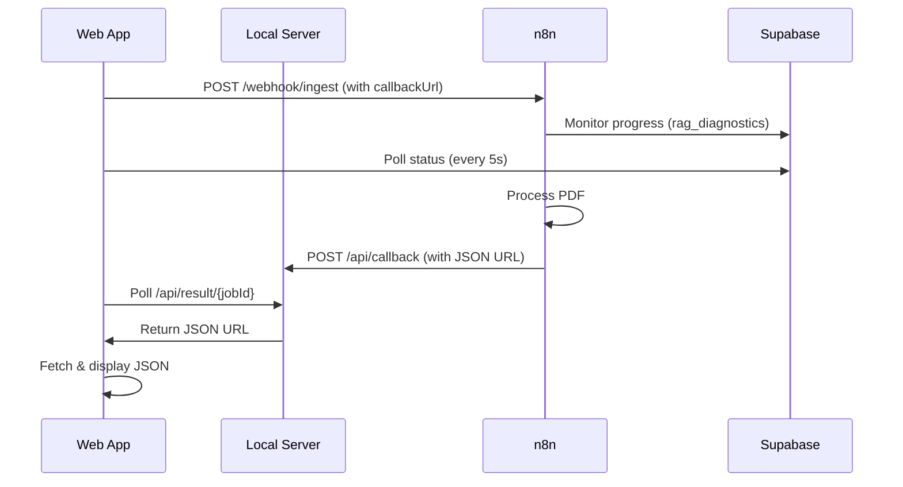
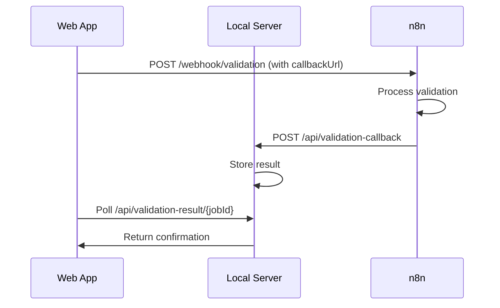

# 📡 Callback Configuration Guide

This guide explains how to configure n8n workflows to send callbacks to the local server.

## 🚀 Quick Start

### 1. Deploy or Run Locally

**Option A - Production (Railway/Heroku/etc):**
The server is already deployed. Just open your app URL.

**Option B - Local Development:**
```bash
python server.py
```
The server will start on `http://localhost:8000`

### 2. Configure the Web App

Open the app (either production URL or `http://localhost:8000`) and go to **Settings**.

The callback URLs are **auto-configured** based on where you're accessing the app:

📍 **If you open**: `http://localhost:8000`
- ✅ Extraction Callback: `http://localhost:8000/api/callback`
- ✅ Validation Callback: `http://localhost:8000/api/validation-callback`

📍 **If you open**: `https://your-app.railway.app`
- ✅ Extraction Callback: `https://your-app.railway.app/api/callback`
- ✅ Validation Callback: `https://your-app.railway.app/api/validation-callback`

**The app automatically detects its URL** using `window.location.origin` - no manual configuration needed!

You can override these in Settings if needed for specific use cases.

## 📤 n8n Workflow Configuration

### Extraction Workflow (PDF Processing)

When the extraction workflow completes, send a **POST request** to the callback URL with this payload:

```json
{
  "jobId": "{{$json.jobId}}",
  "url": "https://supabase.co/storage/v1/object/public/bucket/result.json",
  "fileName": "{{$json.fileName}}",
  "items": 42,
  "durationSec": 245.3,
  "status": "ready"
}
```

**n8n HTTP Request Node Configuration:**
- **Method**: POST
- **URL**: `{{$json.callbackUrl}}` (from initial webhook payload)
- **Body**: JSON (as shown above)
- **Headers**:
  - `Content-Type`: `application/json`
  - `Authorization`: `Bearer {{$json.callbackToken}}` (if token is provided)

### Validation Workflow

When the validation workflow completes, send a **POST request** to the validation callback:

```json
{
  "jobId": "{{$json.jobId}}",
  "status": "success",
  "message": "Validation completed successfully",
  "itemsProcessed": 42
}
```

**n8n HTTP Request Node Configuration:**
- **Method**: POST
- **URL**: `{{$json.callbackUrl}}` (from validation webhook payload)
- **Body**: JSON (as shown above)

## 🔄 How It Works

### Extraction Flow



### Validation Flow



## 🛠️ Production Deployment

### ✅ If you already deployed to Railway/Heroku/etc:

**YOU'RE DONE!** No additional configuration needed. The app auto-configures based on its URL.

Just make sure:
1. You access the app via the production URL (e.g., `https://your-app.railway.app`)
2. The app will automatically use production URLs for callbacks
3. n8n can reach your server (it's publicly accessible)

### 🏠 Local Development with ngrok (if n8n needs to reach localhost):

If you're testing locally but n8n is in the cloud:

```bash
ngrok http 8000
```

Then **manually override** the callback URLs in Settings:
```
Extraction Callback URL: https://abc123.ngrok.io/api/callback
Validation Callback URL: https://abc123.ngrok.io/api/validation-callback
```

### 🚀 First-time Deployment:

Deploy `server.py` to any cloud platform:
1. **Railway/Heroku**: Just push the code, add `requirements.txt`
2. **AWS/GCP**: Use any compute service
3. **Supabase Functions**: Adapt the Flask routes to Edge Functions

The auto-configuration will handle the rest!

## 🔐 Security

### Callback Token

Set a callback token in **Settings** → **Callback Token** to authenticate requests from n8n.

In your n8n workflow, add this header:
```
Authorization: Bearer your-secret-token
```

The server can validate this token (uncomment validation in `server.py`).

## 🐛 Troubleshooting

### Callback Not Received

1. **Check server is running**:
   ```bash
   curl http://localhost:8000/api/health
   ```

2. **Check n8n workflow logs** for callback errors

3. **Verify callback URL** in n8n is correct (check for typos)

### CORS Issues

The server has CORS enabled by default. If you still face issues:
- Check browser console for CORS errors
- Verify the `Origin` header is allowed

### Result Not Loading

1. **Check browser console** for fetch errors
2. **Check server logs** for incoming callback
3. **Manually test endpoint**:
   ```bash
   curl http://localhost:8000/api/result/<job_id>
   ```

## 📊 API Reference

### POST /api/callback

Receives extraction results from n8n.

**Request Body:**
```json
{
  "jobId": "string (required)",
  "url": "string (URL to JSON file)",
  "fileName": "string",
  "items": "number",
  "durationSec": "number",
  "callbackToken": "string (optional)"
}
```

**Response:**
```json
{
  "success": true,
  "message": "Callback received",
  "jobId": "20260320_155206_346589"
}
```

### GET /api/result/:jobId

Polls for extraction results.

**Response (200 OK):**
```json
{
  "jobId": "20260320_155206_346589",
  "url": "https://...",
  "status": "ready",
  "items": 42,
  "receivedAt": "2026-03-20T15:52:10Z"
}
```

**Response (202 Accepted):**
```json
{
  "status": "processing",
  "message": "Result not ready yet"
}
```

### POST /api/validation-callback

Receives validation results from n8n.

**Request Body:**
```json
{
  "jobId": "string (required)",
  "status": "string",
  "message": "string",
  "itemsProcessed": "number"
}
```

### GET /api/validation-result/:jobId

Polls for validation results.

---

## 🎯 Summary

✅ **Auto-configured callbacks** - No manual setup needed for local development
✅ **Real-time progress** - Supabase monitors job status
✅ **Automatic result loading** - Polls server when job completes
✅ **Secure** - Optional token-based authentication
✅ **Production-ready** - Deploy server to any platform

For questions or issues, check the server logs: `python server.py`
